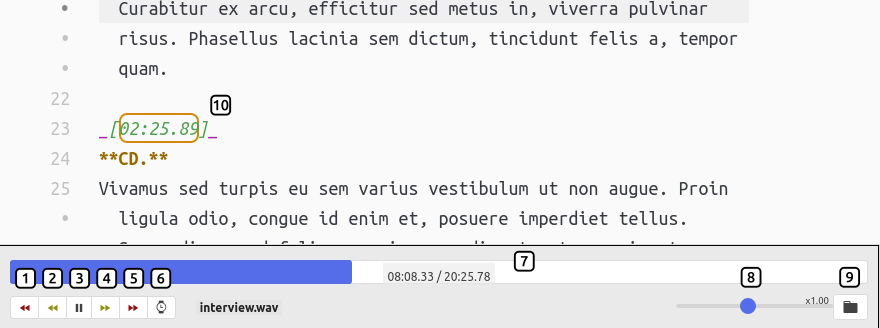

# atom-transcribe

A simple audio and video player for atom to aid text transcription, interview transcription, or video transcription.
Originally based on sdinesh86/atom-music.

## Functionality

| num |        key         | function              | description                                                                                         |
| ---:|:------------------:|:--------------------- | --------------------------------------------------------------------------------------------------- |
|   1 |      `ctrl-1`      | large jump back       | (default: 10sec)                                                                                    |
|   2 |      `ctrl-2`      | short jump back       | (default: 2sec)                                                                                     |
|   3 |    `ctrl-space`    | play/pause            |                                                                                                     |
|   4 |      `ctrl-5`      | small jump forward    | (default: 2sec)                                                                                     |
|   5 |      `ctrl-6`      | large jump forward    | (default: 10sec)                                                                                    |
|   6 |      `ctrl-t`      | insert timestamp      | (default: `_[mm:ss.ms]_`)                                                                           |
|   7 |     (`click`)      | jump to position      |                                                                                                     |
|   8 | `ctrl-3`, `ctrl-4` | change playback speed |                                                                                                     |
|   9 |                    | open file             |                                                                                                     |
|  10 |    (`dblclick`)    | jump to position      | jump to timestamp;  a double click in text interpolates the time between the surrounding timestamps | 
 
Upon opening atom-transcribe, a fuzzy search guesses the audio file.
Currently, ogg, mp3, wav, mp4, and mkv files in the current working folder are matched based on similarity of the opened file and the audio files.

Videos can also be loaded and played, while their visibility can be toggled.

## Possible future features?

* configure speakers and implement shortcuts to add names
* write file name of audio into YAML metadata (for markdown)
* make use of the TextTrack-feature in order to create a visual representation of speakers in the progressbar
